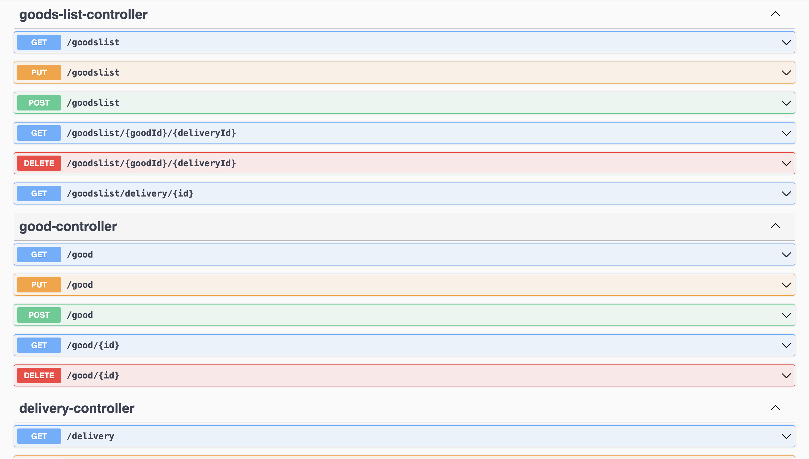
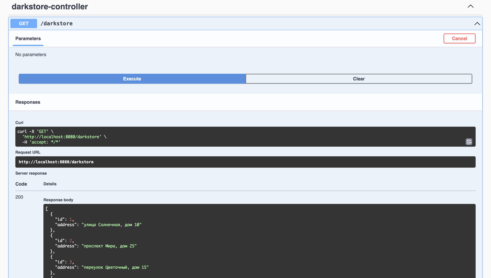
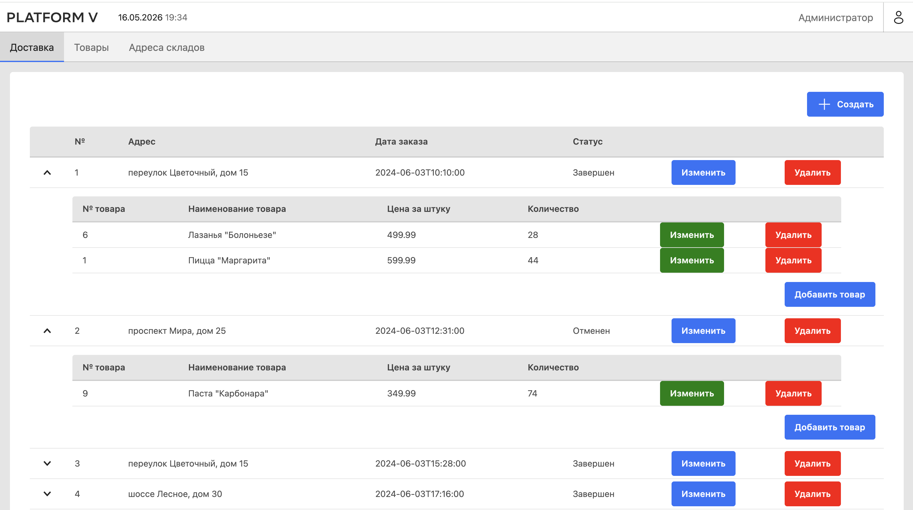
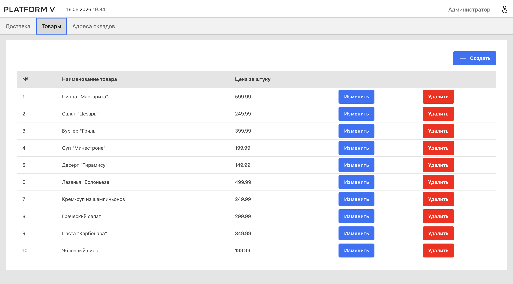
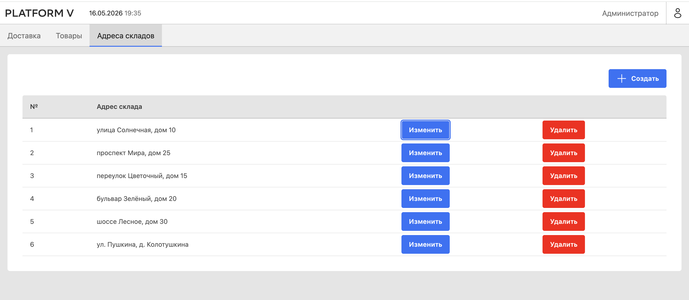
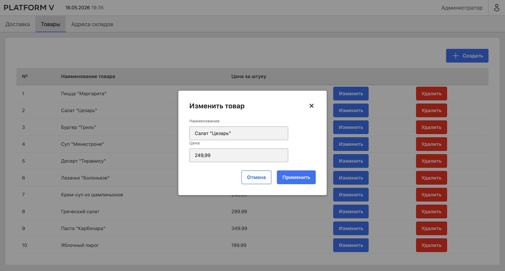

# Supplier Fullstack Bootcamp Project

Учебный fullstack-проект автоматизированной системы поставщиков, выполненный в рамках BootcampLabs.

Проект состоит из двух частей:

- bootcamp-darkstore-provider-awawawwaw — backend-приложение на Java / Spring Boot;
- bootcamp-ui-kit-awawawwaw — frontend-приложение на React / TypeScript.

Предметная область проекта — управление поставками, дарксторами, товарами и доставками.

## Важно об авторстве

Базовый шаблон проекта был предоставлен в рамках учебного bootcamp.  
Моя работа заключалась в настройке проекта, доработке отдельных backend/frontend-сценариев, работе с базой данных, реализацией CRUD-операций, интеграцией frontend с backend и проверкой работоспособности приложения.

Проект размещён в портфолио как учебный кейс, демонстрирующий навыки работы с fullstack-приложением, REST API, базой данных, Swagger и React-интерфейсом.

## Стек технологий

### Backend

- Java
- Spring Boot
- Spring Data JPA
- Hibernate
- Maven
- Lombok
- REST API
- Swagger / OpenAPI

### Frontend

- React
- TypeScript
- Apollo Client
- UI Kit components
- npm

### Database

- PostgreSQL / Pangolin
- SQL
- Таблицы, первичные и внешние ключи
- Тестовое наполнение базы данных

## Структура проекта

```text
bootcamp-supplier-fullstack/
├── bootcamp-darkstore-provider-awawawwaw/   # backend
├── bootcamp-ui-kit-awawawwaw/               # frontend
└── README.md
```

## Что реализовано в backend-части
В backend-части проекта была реализована и проверена работа REST API для основных сущностей системы.

Основные сущности:
- darkstore — склад / даркстор;
- good — товар;
- delivery — доставка;
- goods_list — список товаров в конкретной доставке.

В рамках работы с backend:
- была создана и заполнена база данных для АС поставщиков;
- были настроены связи между таблицами через первичные и внешние ключи;
- были реализованы и проверены REST-эндпоинты;
- была проведена работа со Swagger для тестирования API;
- были проверены CRUD-сценарии для сущностей проекта;
- проект был собран и проверен через Maven.

## Что реализовано во frontend-части
Во frontend-части проекта была доработана работа интерфейса для управления поставками и складами.

В рамках работы с frontend:
- была настроена работа React-приложения;
- была подключена интеграция frontend с backend API;
- были реализованы вкладки для работы с доставками, товарами и адресами складов;
- были добавлены таблицы для отображения данных;
- были реализованы формы создания, редактирования и удаления записей;
- была проверена работа интерфейса через локальный запуск приложения.

## Основные пользовательские сценарии
Приложение позволяет:
- просматривать список складов / дарксторов;
- просматривать список товаров;
- просматривать список доставок;
- создавать новые записи;
- редактировать существующие записи;
- удалять записи;
- тестировать backend API через Swagger;
- работать с данными через frontend-интерфейс.

## Screenshots

### Swagger API





### Frontend









## Как запустить backend
Перейти в папку backend-проекта:
```bash
cd bootcamp-darkstore-provider-awawawwaw
```

Собрать проект:
```bash
./mvnw clean install
```

Запустить приложение:
```bash
./mvnw spring-boot:run
```

После запуска Swagger UI будет доступен по адресу:
```bash
http://localhost:8080/swagger-ui/index.html
```

## Как запустить frontend
Перейти в папку frontend-проекта:
```bash
cd bootcamp-ui-kit-awawawwaw
```

Установить зависимости:
```bash
npm install
```

Запустить приложение:
```bash
npm start
```

После запуска frontend будет доступен локально в браузере.

## Особенности проекта

Проект демонстрирует работу с типичной fullstack-архитектурой:

```bash
Database → Backend REST API → Frontend UI
```

Backend отвечает за хранение и обработку данных, frontend — за пользовательский интерфейс и отправку запросов к API.

## Чему я научилась в процессе

В процессе работы над проектом я потренировалась:

- читать и дорабатывать чужой учебный код;
- разбираться в структуре Spring Boot проекта;
- работать с REST API;
- тестировать backend через Swagger;
- проектировать и заполнять SQL-таблицы;
- связывать frontend с backend;
- работать с React-компонентами и TypeScript;
- запускать fullstack-проект локально;
- оформлять проект для GitHub-портфолио.

## Статус проекта

Учебный проект завершён в рамках bootcamp.
Возможные дальнейшие доработки:

- улучшение README и инструкции запуска;
- более аккуратная обработка ошибок на frontend;
- улучшение валидации форм;
- настройка Docker Compose для более удобного локального запуска.
